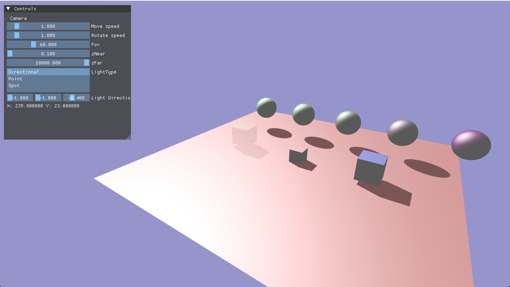
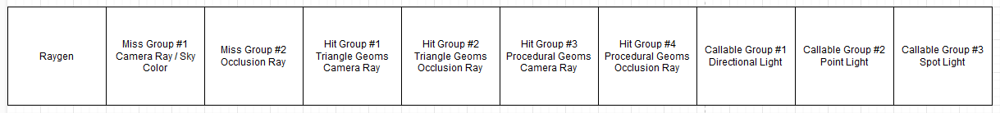

# Vulkan Ray Tracing Pipeline Demo

The scene is rendered using two ray. The first ray(primary ray) is shoot from the camera/generation shader and the second ray(occlusion ray) is shoot from the closest hit shader.
To test intersection shader, the acceleration structures consist of two types of geometries. The cubes are stored as triangle geometries while the spheres are stored as procedural geometries.
To test callable shader, we calculate lighting information of different type in its own callable shader

## Shader Table Layout

